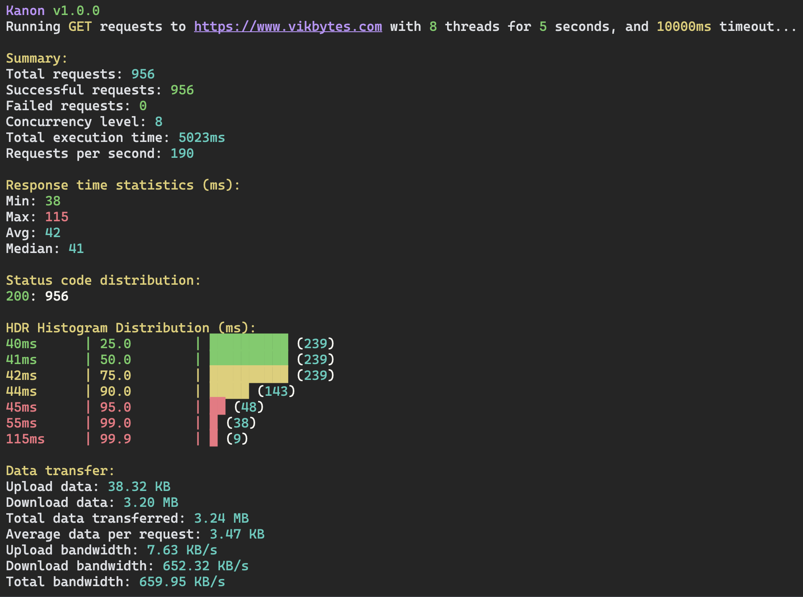

# Kanon

Kanon is a CLI and CI tool for HTTP load testing.

[](#)
[](#)
[](#)
[](#)
[](#)



## Features

- Choose either duration or number of requests
- Choose the number of threads to execute concurrent requests
- Choose timeout for requests
- Run cURL requests
- See HdrHistogram for response time distribution
- See bandwidth metrics
- Save results to file
- CI mode for doing load-testing success/failure in CI pipelines

## Usage

### Run 10 requests

```bash
kanon --url https:///www.vikbytes.com --number 10
```

### Run requests for 5 seconds

```bash
kanon --url https://www.vikbytes.com --duration 5
```

### Run 4 threads concurrently for 10 seconds

```bash
kanon --url https://www.vikbytes.com --concurrent 4 --duration 10
```

### Run in CI mode

Note: Returns exit code 0 if all requests succeeded, 1 otherwise.

```bash
kanon --url https://www.vikbytes.com --duration 5 --ci
```

### Using cURL

```bash
kanon --curl curl https://example.com --concurrent 5 --duration 10
```

### Using cURL from file

```bash
kanon --curl-file curl-command.txt --concurrent 5 --number 100
```

### Help

```bash
kanon --help
```

## Note for quarantined MacOS binary

The binary file for MacOS is not notarized and will be quarantined.
To remove this restriction you need to run:

```bash
sudo xattr -d com.apple.quarantine /path/to/the/kanon/binary
```

Alternatively, you can choose to run the .jar file instead, or build your own binary.

## Builds

### JAR

Requires JVM 21 or newer. https://adoptium.net/temurin/releases/

1. Build the JAR:

```bash
./gradlew fatJar
```

2. Run the JAR:

```bash
java -jar build/libs/kanon.jar --url https://www.vikbytes.com --method GET --concurrent 2 --number 10
```

3. Create script to make available on the PATH

```bash
#!/bin/sh
exec java -jar "/path/to/the/kanon/jar/kanon-1.0.0.jar" "$@"
```

4. Copy script to /usr/local/bin

```bash
sudo cp script_file /usr/local/bin/kanon
```

5. Run kanon

```bash
kanon --url https://www.vikbytes.com --duration 5
```

### Native Binary built via Docker

#### Local Computer OS and Architecture

Native compilation requires GraalVM JDK with the native-image component installed.

1. Install GraalVM JDK (version 21 or newer):
    - Download from: https://www.graalvm.org/downloads/
    - Set JAVA_HOME or GRAALVM_HOME to point to your GraalVM installation

2. Install the native-image component:
   ```bash
   $GRAALVM_HOME/bin/gu install native-image
   ```

3. Run the build script:
   ```bash
   ./build-native.sh
   ```

#### For Linux arm64 via Docker

```bash
./build-linux-native-arm64.sh
```

#### For Linux amd64 via Docker

```bash
./build-linux-native-amd64.sh
```

### Docker

#### Build

```bash
docker build -t kanon -f Dockerfile .
```

#### Run

```bash
docker run --rm kanon [options]
```